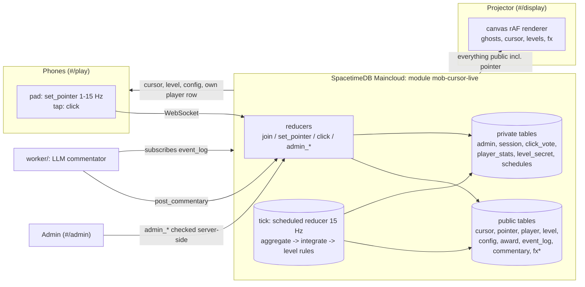

# Mob Cursor

One cursor on a projector, controlled by everyone in the room at once.

Players scan a QR code and drag on their phone. The server pulls a single shared cursor toward the crowd's aggregate pointer, and the crowd has to use it to hit targets, get through a maze and play Minesweeper. Nobody agrees on anything. The projector shows every player's ghost cursor pulling a different way, along with a live **chaos meter**, a leaderboard and end-of-level awards such as *Most Disagreeable Player*.

Built at a hackathon for the SpacetimeDB track (plus *dumbest idea*, *useless AI* and *judged by an LLM*).

- Production DB: `mob-cursor-live` on Maincloud (dashboard: https://spacetimedb.com/mob-cursor-live)
- Demo video: _TODO: add link_
- Live site: _TODO: add Vercel URL after the first deploy_

## The problem (sort of)

Crowd-controlled interfaces (Twitch Plays Pokémon, r/place) are fun because coordination is hard. Making them work live in a room is a real-time systems problem. You need one authoritative state, 100+ phones sending input many times a second, sub-100 ms feedback, fair aggregation that a troll can't hijack, and a budget that doesn't melt when everyone joins at once. Mob Cursor is a small, silly but complete answer to that.

## Architecture



`*fx` is an event table: rows are broadcast and never stored.

There is no backend of our own. Browsers talk directly to Maincloud over WebSocket, and the frontend is a static build.

### Why SpacetimeDB

- **Server-authoritative tick in the database.** `tick` is a scheduled reducer (`reducer({ onSchedule: tickSchedule })`) running at 15 Hz. It reads the fresh pointers, applies the active control rule, integrates mass/damping physics, checks win/lose and writes **one** cursor row. Game rules live only in the module, and clients just render.
- **Subscriptions are the network layer.** The display subscribes to `pointer` to draw ghosts. Phones subscribe only to `cursor`, `config`, `level`, `ghost_frame`, non-vote `fx` and `player WHERE identity = me`, so 100 phones never receive 100 pointer rows at 15 Hz.
- **Lifecycle reducers.** `clientConnected` and `clientDisconnected` maintain a private `session` table, mark presence, delete stale pointers and arm or disarm the tick. With zero players there are zero ticks and zero idle energy.
- **Identity-scoped and private rows.** Admin rights, minesweeper mine positions, click votes and per-player behaviour stats live in private tables. The `am_i_admin` view exposes one per-caller bit from the private `admin` table.
- **Scheduled one-shots.** After a level ends, `advance_schedule` starts the next one 10 s later.
- **Event tables** for sound and particle effects, with no storage cost.
- **Fan-out control.** Phones need everyone's ghost cursors, but subscribing to `pointer` costs N phones × N pointers × Hz messages. Instead, the tick packs every fresh pointer into a single `ghost_frame` row (6 bytes per player, with a stable per-player key so phones can glide each ghost between frames) at 5 Hz, so each phone gets one small row update. The row isn't rewritten while nobody moves.

## What actually works

| Feature | Status |
|---|---|
| Shared cursor, 15 Hz server tick, client-side prediction | ✅ verified locally and on Maincloud |
| Join via QR, mobile pad, names/colors/teams, presence cleanup | ✅ verified (headless iPhone viewport) |
| Per-route subscription scoping (phones never get `pointer`) | ✅ |
| Control rules: mean, geometric median, activity-weighted (capped), team tug-of-war, rotating dictator | ✅ unit-tested + live switchable |
| Click quorum (N votes within radius and time window) | ✅ verified with bots |
| Admin panel, server-side checks, passphrase claim | ✅ verified that a stranger gets `not an admin` |
| Chaos meter, ghost cursors, tug lines, reducer-calls/sec HUD | ✅ |
| Levels: targets, maze, minesweeper; auto-advance | ✅ |
| Leaderboard, awards from per-level stats | ✅ |
| Party flow: each game runs 3 stages of rising difficulty (moving targets, bigger mazes, more mines), 3-2-1 countdown, results screen, auto-advance | ✅ |
| Minesweeper auto-click: the server clicks wherever the cursor is after a random 2-30 s, with a 5 s fuse shown on screen | ✅ |
| Everyone's ghost cursors on phones too, from one packed `ghost_frame` row at 5 Hz (no pointer subscription) | ✅ |
| "MobOS 95" UI: pixel-art sprite set generated from code (`src/game/sprites.ts`, SVGs in `public/assets/`), lobby, intro and results dialogs | ✅ |
| Config-driven pointer rate (`pointerHzEffective`), dead-band, heartbeat | ✅ |
| Bot load-test script + Maincloud measurements | ✅ (results below) |
| Sound effects, screen shake, confetti, heatmap of cursor path | ✅ |
| LLM commentator worker (`worker/`) | ✅ pipeline verified in dry-run mode (claims admin, reacts to events, posts lines). The live Claude call hasn't been exercised yet because no API key was available while building |
| Stretch levels (typing, DMV form, Pong, captcha), saboteurs, replay | ❌ not built |

## Control rules

| Rule | Target = | Why |
|---|---|---|
| `mean` | average of fresh pointers, each weight capped at `influenceCap` | democracy |
| `median` | geometric median (Weiszfeld) | one troll in the corner barely moves it |
| `activity` | weighted by recent movement, capped | the loudest win, but only up to the cap |
| `tug` | average of the red team mean and the blue team mean | teams pull with equal force regardless of size |
| `dictator` | one random fresh player for `dictatorSecs` | 👑 |

Chaos is `1 - |mean of unit vectors from the cursor to each pointer|`: 0 when everyone pulls the same way, 1 when the pulls cancel out.

## Load and energy

The pointer stream dominates cost, so the client throttle is the main lever:

- Clients send at `config.pointerHzEffective = clamp(min(pointerHz, pointerBudget / players), 1, 30)`. The defaults are 15 Hz (the tick rate; anything faster is overwritten before the tick reads it) and a 400 calls/s budget, and clients follow live changes.
- A move sends immediately if a full interval has passed (leading edge), otherwise at the end of the interval. Moves under 0.4% of the pad are skipped apart from a 1 s heartbeat, and nothing is sent while the tab is hidden.
- `set_pointer` validates and clamps input, and silently drops calls beyond 2x the advertised rate (with a burst allowance of 4, so network-bunched packets still land) as a safety net.
- The display HUD shows observed pointer, click and tick calls per second.

### Measured on Maincloud (`scripts/bots.ts`, throwaway DB `mob-cursor-loadtest`)

The bots behave like the phone client: they follow the same Hz, dead-band and heartbeat rules, 15% of them troll the opposite corner, and each clicks about 0.3 times/s. One extra observer connection subscribes like the display.

| bots | effective Hz | set_pointer/s | click/s | reducer p50 / p95 / p99 | tick rate | tick gap p95 / max |
|---|---|---|---|---|---|---|
| 50 | 8 | 335 | 14 | 29 / 35 / 40 ms | 14.98 Hz | 71 / 204 ms |
| 100 | 4 | 351 | 29 | 30 / 39 / 124 ms | 14.99 Hz | 73 / 177 ms |

The budget did its job: doubling the players left the pointer call rate almost flat (335 → 351/s), and the tick held at 15 Hz. Latency includes the WAN round trip from the test machine. Raw output is in `loadtest-results/`.

### Energy estimate (rough)

Maincloud's pricing page says the free tier's 2,500 TeV is worth about 3,000,000 function calls or about 12.5 GB of egress. That works out to roughly **0.00083 TeV per call** and **200 TeV per GB**. With those numbers:

- **Per player-hour:** about 6.7 pointer calls/s (measured at 8 Hz, constant movement; real people hold still and send less) plus about 0.3 clicks/s, so roughly 25k calls, or **~21 TeV**. Egress to the display and the phone's 15 Hz cursor stream add about 10 MB, or **~2 TeV**.
- **Per room-hour (tick):** 54k scheduled calls, or **~45 TeV**, and only while someone is connected.
- **Hard ceiling:** the 400 calls/s budget caps pointer traffic at about **1,200 TeV per hour** no matter how many people join.

A 30-person, 20-minute demo comes to about 30 × 23 / 3 + 15 ≈ **250 TeV**, roughly 10% of the free tier. These are list-price equivalences. The dashboard's usage breakdown is the source of truth, and the tick is heavier than a `set_pointer` call.

## Running it

Requirements: Node 24, SpacetimeDB CLI **2.10.2** (`spacetime version install 2.10.2 && spacetime version use 2.10.2`).

```bash
npm ci && (cd spacetimedb && npm ci)

# Local: start a local SpacetimeDB, publish, run Vite against it
spacetime start                         # separate terminal
npm run spacetime:publish:local
npm run dev:localdb                     # http://localhost:5173/#/display

# Production (Maincloud): .env.local holds VITE_SPACETIMEDB_HOST / _DB_NAME (see .env.example)
npm run spacetime:publish               # publishes mob-cursor-live
npm run dev                             # local frontend against Maincloud
```

Open `#/display` on the projector and scan the QR code with phones (`#/play`). If the display runs on `localhost`, set `VITE_PUBLIC_URL` to a LAN or production URL so the QR code points somewhere phones can reach.

## Deploy (one-time setup)

### Module: GitHub Actions to Maincloud
1. Push this repo to GitHub.
2. On your machine (already logged in to the CLI), copy your CLI token: `spacetime login show --token`. Treat it like a password.
3. In the GitHub repo, go to **Settings → Secrets and variables → Actions → New repository secret**. Name it `SPACETIMEDB_TOKEN` and paste the token.
4. **Verify token auth on a throwaway DB first:** go to **Actions → Publish module → Run workflow** and keep the default database, `mob-cursor-ci-test`. If it's green, CI can publish as you.
5. From then on, every push to `main` that touches `spacetimedb/` publishes `mob-cursor-live`. The workflow never passes `--delete-data`, and it only auto-confirms `remote,migrate`, so breaking schema changes fail loudly instead of wiping data.

### Frontend: Vercel (Git integration)
1. On vercel.com, choose **Add New → Project** and import the GitHub repo. The framework is auto-detected (`vercel.json` pins `npm ci` / `npm run build` / `dist`).
2. Under **Environment Variables** (Production, and Preview if you want it), add:
   - `VITE_SPACETIMEDB_HOST` = `https://maincloud.spacetimedb.com`
   - `VITE_SPACETIMEDB_DB_NAME` = `mob-cursor-live`
   - optionally `VITE_PUBLIC_URL` = your production URL (the QR target)
3. Deploy. Every push to `main` redeploys, and PRs get preview URLs. Hash routes (`#/display`) mean no rewrite rules are needed.

The client build never needs the module: `src/module_bindings/` is committed, and CI fails if it's stale.

## Admin

`init` records the publisher's identity as admin. To use the admin panel from a browser:

```bash
spacetime call mob-cursor-live admin_set_passphrase '"<long passphrase>"' --server maincloud
```

Then open `#/admin` and enter the passphrase. Only a salted SHA-256 is stored, and every `admin_*` reducer checks `ctx.sender` against the private `admin` table.

## Tests and tools

```bash
npm test                                  # sim unit tests (rules, physics, maze, minesweeper, sha256)
npm run typecheck
npx tsx scripts/smoke.ts                  # two clients see the same cursor (STDB_HOST / STDB_DB env)
npx tsx scripts/bots.ts --bots 50 --seconds 60 --host ws://127.0.0.1:3000 --db mob-cursor --out result.json
```

## Repo layout

```
spacetimedb/src/schema.ts   tables
spacetimedb/src/index.ts    reducers, tick, levels, awards, admin
spacetimedb/src/sim.ts      pure math (rules, physics, maze, minesweeper, sha256): unit-tested, shared with the client renderer
src/routes/                 Display / Play / Admin (React chrome only)
src/display/render.ts       canvas renderer (rAF, reads the SDK cache directly)
src/module_bindings/        generated by `npm run spacetime:generate`, committed
scripts/                    smoke test, bot swarm / load test
DECISIONS.md                small design decisions and gotchas
```
